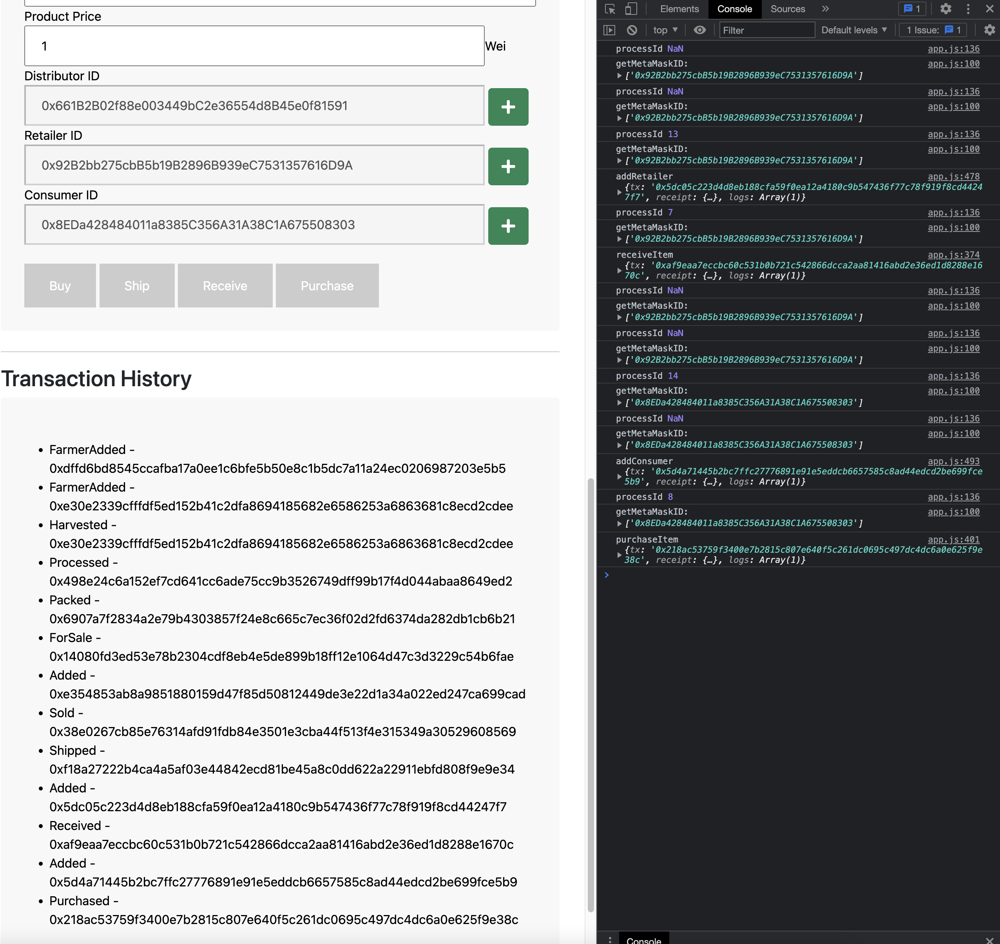
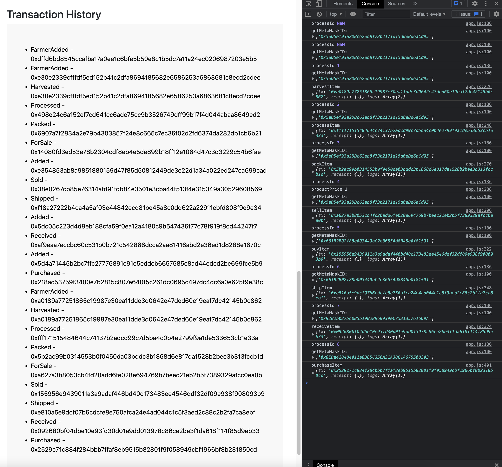

# Coffee Supply Chain

## SupplyChain

[2022/07/26]Contract address

  `0x23c3d86eb0707c1F376be2D4bDA4eaF1C648fc57`

   https://rinkeby.etherscan.io/address/0x23c3d86eb0707c1F376be2D4bDA4eaF1C648fc57


[2022/07/25]Contract address

  `0xEEA9462CB4d8Ffae07224a6ae78eA44967a6a48a`

   https://rinkeby.etherscan.io/address/0xEEA9462CB4d8Ffae07224a6ae78eA44967a6a48a


[2022/07/17]Contract address

  `0x6015891e7aD1904a3b6dDBE29bCD01F6471c3889`

   https://rinkeby.etherscan.io/address/0x6015891e7aD1904a3b6dDBE29bCD01F6471c3889

## Truffle version

```bash
Truffle v5.5.21 (core: 5.5.21)
Ganache v7.2.0
Solidity v0.5.16 (solc-js)
Node v16.13.2
Web3.js v1.7.4
```

## Smart contracts

### Libraries

Roles

  add
  remove
  has

Note: For testing, I commented-out checking existing account on add function of Roles.sol

```sol
// require(
//     !has(role, account),
//     "account is already a member of this role"
// );

```

## Package.json

```json
{
    "dotenv": "^16.0.1",
    "truffle-blockchain-utils": "^0.0.10",
    "truffle-hdwallet-provider": "^1.0.17",
    "web3": "^1.2.1",
    "web3-utils": "^1.2.1"
}
```

※Other packages were installed, but I did not use in this project

## Sequence


## Transaction history

```
FarmerAdded - 0xdffd6bd8545ccafba17a0ee1c6bfe5b50e8c1b5dc7a11a24ec0206987203e5b5
FarmerAdded - 0xe30e2339cfffdf5ed152b41c2dfa8694185682e6586253a6863681c8ecd2cdee
Harvested - 0xe30e2339cfffdf5ed152b41c2dfa8694185682e6586253a6863681c8ecd2cdee
Processed - 0x498e24c6a152ef7cd641cc6ade75cc9b3526749dff99b17f4d044abaa8649ed2
Packed - 0x6907a7f2834a2e79b4303857f24e8c665c7ec36f02d2fd6374da282db1cb6b21
ForSale - 0x14080fd3ed53e78b2304cdf8eb4e5de899b18ff12e1064d47c3d3229c54b6fae
Added - 0xe354853ab8a9851880159d47f85d50812449de3e22d1a34a022ed247ca699cad
Sold - 0x38e0267cb85e76314afd91fdb84e3501e3cba44f513f4e315349a30529608569
Shipped - 0xf18a27222b4ca4a5af03e44842ecd81be45a8c0dd622a22911ebfd808f9e9e34
Added - 0x5dc05c223d4d8eb188cfa59f0ea12a4180c9b547436f77c78f919f8cd44247f7
Received - 0xaf9eaa7eccbc60c531b0b721c542866dcca2aa81416abd2e36ed1d8288e1670c
Added - 0x5d4a71445b2bc7ffc27776891e91e5eddcb6657585c8ad44edcd2be699fce5b9
Purchased - 0x218ac53759f3400e7b2815c807e640f5c261dc0695c497dc4dc6a0e625f9e38c
FarmerAdded - 0xa0189a77251865c19987e30ea11dde3d0642e47ded60e19eaf7dc42145b0c862
Harvested - 0xa0189a77251865c19987e30ea11dde3d0642e47ded60e19eaf7dc42145b0c862
Processed - 0xfff171515484644c74137b2adcd99c7d5ba4c0b4e2799f9a1de533653cb1e33a
Packed - 0x5b2ac99b0314553b0f0450da03bddc3b1868d6e817da1528b2bee3b313fccb1d
ForSale - 0xa627a3b8053cb4fd20add6fe028e694769b7beec21eb2b5f7389329afcc0ea0b
Sold - 0x155956e9439011a3a9adaf446bd40c173483ee4546ddf32df09e938f908093b9
Shipped - 0xe810a5e9dcf07b6cdcfe8e750afca24e4ad044c1c5f3aed2c88c2b2fa7ca8ebf
Received - 0x092680bf04dbe10e93fd30d01e9dd013978c86ce2be3f1da618f114f85d9eb33
Purchased - 0x2529c71c884f284bbb7ffaf8eb9515b82801f9f058949cbf1966bf8b231850cd
```




