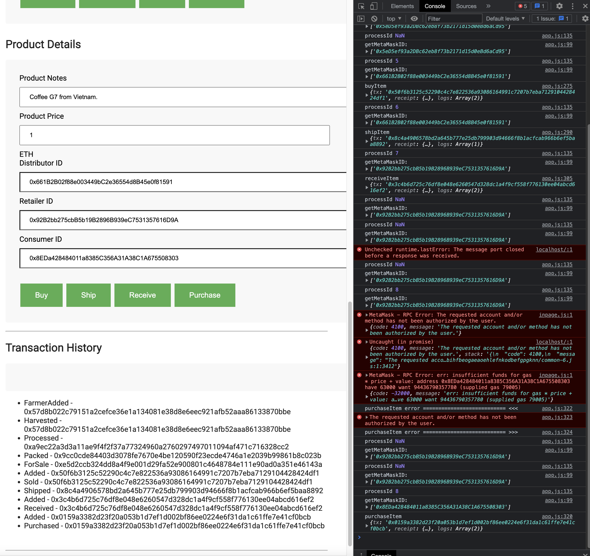

# Note

## SupplyChain

[2022/07/25]Contract address

  `0xEEA9462CB4d8Ffae07224a6ae78eA44967a6a48a`

   https://rinkeby.etherscan.io/address/0xEEA9462CB4d8Ffae07224a6ae78eA44967a6a48a


[2022/07/17]Contract address

  `0x6015891e7aD1904a3b6dDBE29bCD01F6471c3889`

   https://rinkeby.etherscan.io/address/0x6015891e7aD1904a3b6dDBE29bCD01F6471c3889

## Truffle version

```bash
Truffle v5.5.21 (core: 5.5.21)
Ganache v7.2.0
Solidity v0.5.16 (solc-js)
Node v16.13.2
Web3.js v1.7.4
```

## Smart contracts

### Libraries

Roles

  add
  remove
  has

Note: For testing, I commented-out checking existing account on add function of Roles.sol

```sol
// require(
//     !has(role, account),
//     "account is already a member of this role"
// );

```

## Package.json

```json
{
    "dotenv": "^16.0.1",
    "truffle-blockchain-utils": "^0.0.10",
    "truffle-hdwallet-provider": "^1.0.17",
    "web3": "^1.2.1",
    "web3-utils": "^1.2.1"
}
```

※Other packages were installed, but I did not use in this project

## Transaction history

```
FarmerAdded - 0x57d8b022c79151a2cefce36e1a134081e38d8e6eec921afb52aaa86133870bbe
Harvested - 0x57d8b022c79151a2cefce36e1a134081e38d8e6eec921afb52aaa86133870bbe
Processed - 0xa9ec22a3d3a11ae9f4f2f37a77324960a2760297497011094af471c716328cc2
Packed - 0x9cc0cde84403d3078fe7670e4be120590f23ecde4746a1e2039b99861b8c023b
ForSale - 0xe5d2ccb324dd8a4f9e001d29fa52e900801c4648784e111e90ad0a351e46143a
Added - 0x50f6b3125c52290c4c7e822536a93086164991c7207b7eba7129104428424df1
Sold - 0x50f6b3125c52290c4c7e822536a93086164991c7207b7eba7129104428424df1
Shipped - 0x8c4a4906578bd2a645b777e25db799903d94666f8b1acfcab966b6ef5baa8892
Added - 0x3c4b6d725c76df8e048e6260547d328dc1a4f9cf558f776130ee04abcd616ef2
Received - 0x3c4b6d725c76df8e048e6260547d328dc1a4f9cf558f776130ee04abcd616ef2
Added - 0x0159a3382d23f20a053b1d7ef1d002bf86ee0224e6f31da1c61ffe7e41cf0bcb
Purchased - 0x0159a3382d23f20a053b1d7ef1d002bf86ee0224e6f31da1c61ffe7e41cf0bcb
```




## Sequence


